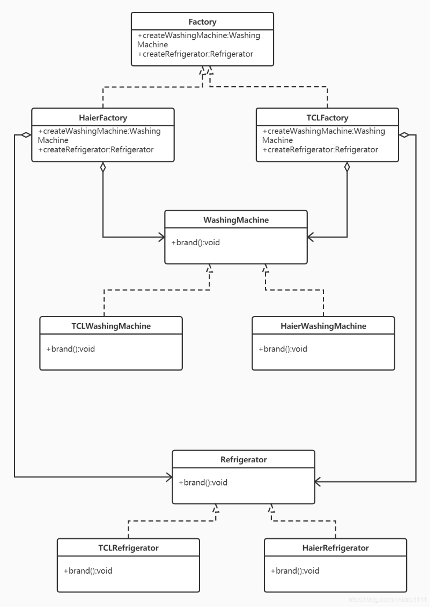

# Abstract Factory

## 动机(motivation)
+ 在软件系统中，经常面临着“一系列相互依赖的对象工作”；同时，由于需求的变化，往往存在更多系列对象的创建工作。
+ 如何应对这种变化？如何绕过常规的对象创建方法(new)，提供一种“封装机制”来避免客户程序和这种“多系列具体对象创建工作”的紧耦合。

## 模式定义
提供一个接口，让该接口负责创建一系列"相关或者相互依赖的对象"，无需指定它们具体的类。
——《设计模式》GoF

## 要点总结
+ 如果没有应对"多系列对象创建"的需求变化，则没有必要使用Abstract Factory模式，这时候使用简单的工厂即可。
+ “系列对象”指的是在某一个特定系列的对象之间有相互依赖、或作用的关系。不同系列的对象之间不能相互依赖。
+ Abstract Factory模式主要在于应用“新系列”的需求变动。其缺点在与难以应对“新对象”的需求变动。

## 类图

