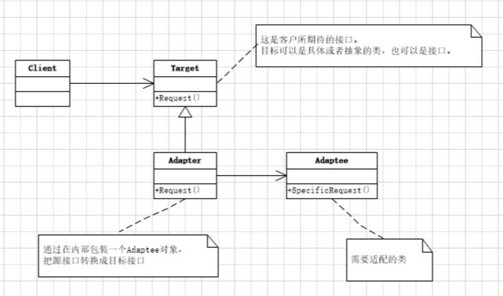

# Adapter

## 动机(Motivation)
+ 由于应用环境的变化，常常需要将“一些现存的对象”放在新的环境中应用，但是新环境要求的接口是这些现存对象所不满足。
+ 如何应对这些“迁移的变化”？

## 模式定义
将一个类的接口转换成客户希望的另一个接口。Adapter模式使得原本由于接口不兼容而不能一起工作的那些类可以一起工作。
——《设计模式》GoF

## 要点总结
+ 在遗留代码复用、类库迁移等方面有用
+ 分为类适配器和对象适配器
    ```
    类适配器使用继承关系来实现，对象适配器使用组合关系来实现.
    类适配器的耦合度高，限制了适配器只能适配一个适配者类
    ```
## 类图
