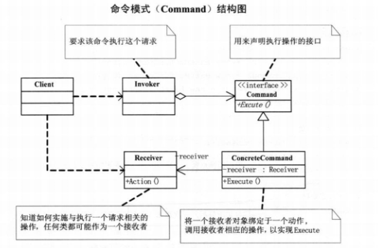

# Command

## 动机(Motivation)
+ “行为请求者”与“行为实现者”通常呈现一种“紧耦合”。但在某些场合——比如需要对行为进行“记录、撤销、事务”等处理，这种无法抵御变化的紧耦合是不合适的。
+ 在这种情况下，如何将“行为请求者”与“行为实现者”解耦？**将一组行为抽象为对象**，可以实现二者之间的松耦合。

## 模式定义
将一个请求(行为)封装成一个对象，从而使你可用不同的请求对客户进行参数化；对请求排队或记录请求日志，以及支持可撤销的操作。
——《设计模式》GoF

## 要点总结
+ Command模式的根本目的在于将“行为请求者”与“行为实现者”解耦，在面向对象语言中，常见的实现手段是“将行为抽象为对象”。
+ 与C++中的函数对象类似，C++函数对象以函数签名来定义行为接口规范，更灵活性能更高。

## 类图
