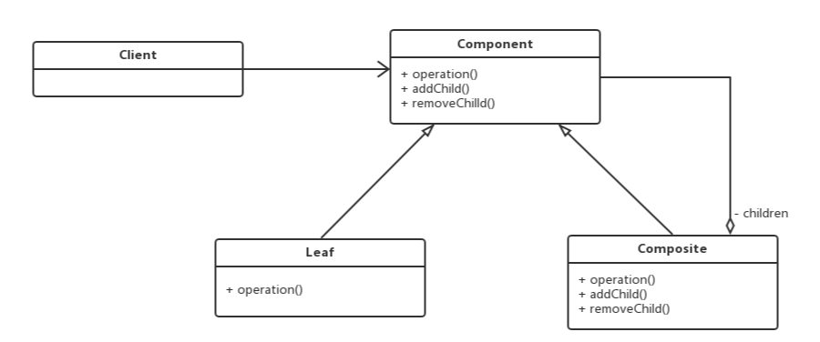

# Composite

## 动机(Motivation)
+ 客户代码过多地依赖于对象容器复杂的内部实现结构，对象容器内部实现结构(而非抽象结构)的变化引起客户代码的频繁变化，带来了代码的维护性、扩展性等弊端。
+ 如何将“客户代码与复杂的对象容器结构”解耦？让对象容器自己来实现自身的复杂结构，从而使得客户代码就像处理简单对象一样来处理复杂的对象容器？

## 模式定义
将对象组合成树形结构以表示“部分-整体”的层次结构。Composite使得用户对单个对象和组合对象的使用具有一致性(稳定)。
——《设计模式》GoF

## 要点总结
+ Composite模式采用树性结构来实现普遍存在的对象容器，从而将“一对多”的关系转化为“一对一”的关系，使得客户代码可以一致地(复用)处理对象和对象容器，无需关心处理的是单个的对象，还是组合的对象容器。
+ 客户代码与纯粹的抽象接口——而非对象容器的内部实现结构——发生依赖，从而更能“应对变化”。
+ Composite模式在具体实现中，可以让父对象中的子对象反向追溯；如果父对象有频繁的遍历需求，可使用缓存技术来改善效率。
+ 组合模式可以分为安全模式和透明模式
    ```
    透明模式：
    1. 组合对象和叶子对象实现相同的接口(代码中使用了透明模式)
    2. 客户端针对抽象编程，无须关心具体实现是组合对象还是叶子对象
    安全模式：
    1. 组合对象和叶子对象实现不同的接口
    2. 客户端针对抽象编程，需要关系具体实现是组合对象还是叶子对象
    ```

## 类图



