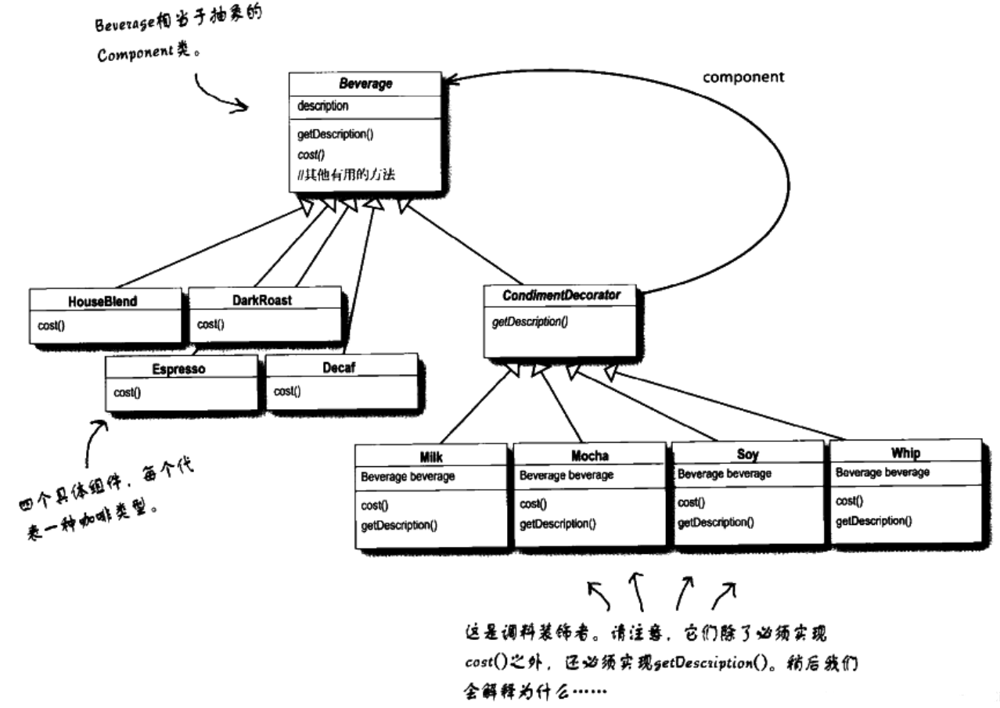

## 装饰模式的结构通常包括以下几个角色：

+ Component（组件）：Component 是一个抽象类或接口，定义了被装饰者和装饰者共同的接口。
+ ConcreteComponent（具体组件）：ConcreteComponent 是实现了 Component 接口的具体对象，它是被装饰的原始对象。
+ Decorator（装饰者）：Decorator 是一个抽象类或接口，它继承自 Component，并持有一个 Component 类型的引用（或指针）。Decorator 的主要责任是在调用原始对象的相应方法之前或之后，执行额外的行为。
+ ConcreteDecorator（具体装饰者）：ConcreteDecorator 是 Decorator 的子类，它实现了装饰者定义的接口，并通过在被装饰对象上添加额外的行为或功能来扩展其功能。

## 装饰者模式的优点：
+ 装饰者模式可以动态地添加或删除对象的功能，从而实现灵活的扩展和定制。
+ 通过使用装饰模式，你可以在不修改现有对象的情况下，动态地添加、修改或删除对象的功能。这种模式常用于需要动态地组合多个功能、对对象的行为进行细粒度控制、以及在不破坏封装性的前提下扩展对象功能的情况。

## 装饰者模式

