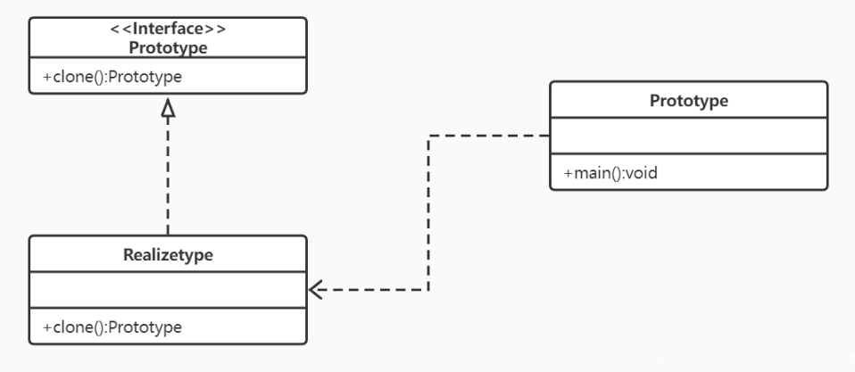

# Prototype

## 动机(motivation)
+ 在软件系统中，经常面临这“某些结构复杂的对象”的创建工作；由于需求的变化，这些对象经常面临着剧烈的变化，但是它们却拥有比较稳定一致的接口。
+ 如何应对这种变化？如何向“客户程序(使用这些对象的程序)”隔离出“这些易变对象”，从而使得依赖这些“易变对象”的客户程序不随着需求改变而改变。

## 模式定义
使用原型实例指定创建对象的种类，然后通过拷贝这些原型来创建新的对象。
——《设计模式》GoF

## 要点总结
+ Prototype模式同样用于隔离对象的使用者和具体类型(易变类)之间的耦合关系，它同样要求这些“易变类”拥有稳定的接口。
+ Prototype模式对于“如何创建易变类的实体对象“采用”原型克隆“的方法来做，
它使得我们可以非常灵活地动态创建“拥有某些稳定接口"的新对象——所需工作仅仅是注册一个新类的对象(即原型)，
然后在任何需要的地方Clone。
+ Prototype模式中的Clone方法可以利用某些框架中的序列化来实现深拷贝。(cpp也可以使用指针实现深拷贝)

