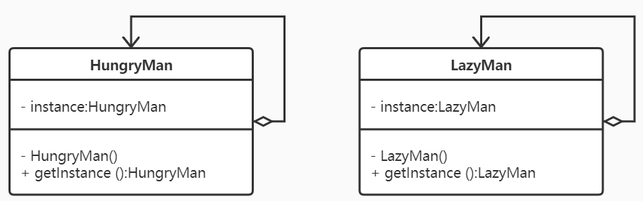

# Singleton

## 动机(Motivation)
+ 在软件系统中，经常有这样一些特殊的类，必须保证它们在系统中只存在一个实例，才能确保它们的逻辑正确性、以及良好的效率。
+ 如何绕过常规的构造器，提供一种机制来保证一个类只有一个实例？
+ 这应该是类设计者的责任，而不是使用者的责任。

## 模式定义
保证一个类仅有一个实例，并提供一个该实例的全局访问点。
——《设计模式》GoF

## 要点总结
+ Singleton模式中的实例构造器可以设置为protected以允许子类派生。
+ Singleton模式一般不要支持拷贝构造函数和Clone接口，因为这有可能导致多个对象实例，与Singleton模式的初衷违背。
+ 如何实现多线程环境下安全的Singleton？注意对双检查锁的正确实现。
+ 单例模式有饿汉模式和懒汉模式。
    ```
    懒汉模式：第一次被使用才进行初始化，实例的初始化放在函数内部
            经典的线程安全懒汉模式，使用双检测锁模式。
            利用局部静态变量实现线程安全懒汉模式
    饿汉模式：在程序运行时就立即初始化。
    ```
+ 饿汉模式虽好，但其存在隐藏的问题，在于非局部静态对象（函数外的static对象）在不同编译单元中的初始化顺序是未定义的。如果在初始化完成之前调用 getInstance() 方法会返回一个未定义的实例。

## 类图
